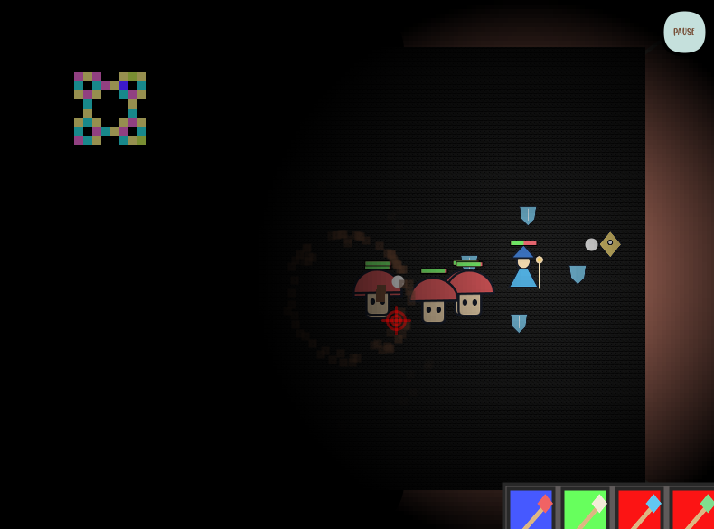

# Dungeon Crawl — Restored Prototype

## Run

1. Extract the entire ZIP.
2. Ensure the folder containing `RPG.pde` is named **RPG**.
3. Open `RPG.pde` in Processing using **Java mode**.
4. Press **Run**, then click **PLAY** inside the game.
5. The original instruction sequence lasts roughly 20 seconds at 60 FPS.

Keep all `.pde` files and asset folders together inside **RPG**. No JavaFX library is required by this restored version.

## Controls

| Input | Action |
| --- | --- |
| WASD | Move |
| Mouse | Aim |
| Space | Shoot |
| 1–4 | Select weapons as they unlock |
| PAUSE button | Open the pause and upgrade interface |

## Restoration Changes

- Removed the JavaFX import and renderer dependency; now uses the default Java2D renderer.
- Added `RestoredAssets.pde` to draw placeholders for missing wizard, ranger, mushroom, turret, portal, defeat-screen, wand, and shield graphics.
- Retained existing artwork, fonts, map, and gameplay code where possible.
- Updated **AGAIN** to reset the full game state, including enemies and items.

## Validation

Compiled successfully with **Processing 3.5.4 on Linux**.
